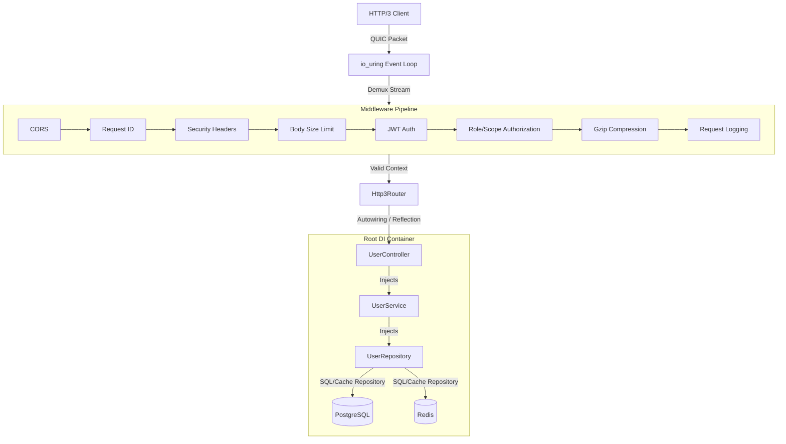

# 🚀 NovaBoot

**NovaBoot** is a production-grade, multi-protocol (HTTP/3, HTTP/2, HTTP/1.1) C++ web framework designed for ultra-high throughput and low-latency microservices. By combining modern Linux-native kernel features with cutting-edge C++26 language specifications, NovaBoot delivers an ergonomics-first developer experience comparable to Spring Boot, without sacrificing native C++ performance.

---

## ✨ Core Pillars

*   **🔒 Multi-Protocol Engine:** Supports HTTP/3 (built natively on QUIC/`ngtcp2` & `nghttp3`), HTTP/2 (`nghttp2`), and HTTP/1.1 with integrated TLS (`OpenSSL 3.5+`). High-speed, multiplexed, and backward-compatible by design.
*   **⚡ io_uring Event Loop:** Utilizes modern Linux kernel `io_uring` for asynchronous I/O and networking, sharded across worker threads matching CPU cores to eliminate context-switching overhead.
*   **🔮 C++26 Static Reflection & DI:** First-class Dependency Injection and Inversion of Control (IoC) powered by GCC 16+'s static reflection (`P2996`/`P3385`). Zero custom compilers/preprocessors; true compile-time autowiring of constructors and fields.
*   **📦 Zero-Boilerplate Serialization:** Directly serialize and deserialize C++ structs to/from JSON via reflection using a high-performance `simdjson` backend.
*   **🛠️ Production-Ready Middlewares:** Built-in modular pipeline containing CORS, Request ID tracing, Security Headers, Body Size Limits, JWT Verification, Scope-based Authorization, Gzip compression, and structured request logging.
*   **💾 Enterprise Data Layer:** Seamless PostgreSQL ORM integration (via ODB compiler macro) and Redis support (via `redis++`). Pre-configured caching repository patterns out of the box.

---

## 🏛️ Architectural Overview



---

## 🛠️ System Requirements & Dependencies

The framework relies on modern Linux APIs and compiler implementations.

*   **OS:** Linux (Kernel 5.6+ required for full `io_uring` features).
*   **Compiler:** GCC 16.1.1+ (configured with `-freflection` to support the C++26 reflection standard).
*   **Build System:** CMake 3.25+.
*   **Required Packages (Arch Linux / Ubuntu):**
    *   `liburing`
    *   `openssl` (3.5.0+)
    *   `ngtcp2` & `ngtcp2_crypto_ossl`
    *   `nghttp3`
    *   `nghttp2` (required for build framing helpers)
    *   `spdlog`
    *   `simdjson`
    *   `tomlplusplus`
    *   `redis++` & `hiredis`
    *   `libodb` & `libodb-pgsql`
    *   `gtest` (for unit tests)
    *   `benchmark` (for performance evaluation)

---

## 🚀 Getting Started

### 1. Spin up PostgreSQL and Redis
A pre-configured `docker-compose.yml` is provided at the project root for local development.

```bash
docker-compose up -d
```

This starts:
- **PostgreSQL 17** (Port: `5432`, DB: `novadb`, User: `nova`, Password: `secret`)
- **Redis 7** (Port: `6379`)

### 2. Configure and Build the Project
A unified build script `build.sh` handles compilation, ODB schema generation, and dependency linking.

```bash
# Clean previous builds and configure CMake
./build.sh --clean

# Compile only
./build.sh
```

### 3. Run the Test Suite
Ensure all DI, middleware, data, and protocol features function correctly on your machine:

```bash
./build.sh --test
```

---

## 💻 Code Showcase

NovaBoot relies on structural patterns that leverage **C++26 Static Reflection** to automate repetitive web-app code.

### 1. DTO & Validation Schema
Define standard C++ structs and register validations declaratively without writing manual parser logic.

```cpp
#include "novaboot/validation/validation.h"
#include <string>

struct UserDto {
    std::string username;
    std::string email;
    int age;

    // Declarative schema definition mapped to struct fields
    inline static const novaboot::validation::Schema<UserDto> validator =
        novaboot::validation::Schema<UserDto>()
            .field<&UserDto::username>("username").not_empty().size(3, 20)
            .field<&UserDto::email>("email").email()
            .field<&UserDto::age>("age").min(18);
};
```

### 2. Service & Controller Injection
Write standard C++ controller classes. The DI container resolves references and autowires dependencies via reflection.

```cpp
#include "novaboot/novaboot.h"
#include "service/user_service.h"

struct UserController {
    UserService& user_service;

    // Constructor injection is autowired by the DI root container
    explicit UserController(UserService& svc) : user_service(svc) {}

    // Endpoints inject the request context and parsed request variables automatically
    ResponseEntity<User> get_user(int id, RequestContext& ctx) {
        return ResponseEntity<User>::ok(user_service.get_user(id));
    }

    ResponseEntity<User> create_user(UserDto user_dto, RequestContext& ctx) {
        // Validation and deserialization are handled automatically before this point
        auto saved = user_service.create(user_dto);
        return ResponseEntity<User>::status(201, saved);
    }
};
```

### 3. Composition Root Configuration
Configure your application settings, databases, beans, and pipeline mapping in `main.cpp`.

```cpp
#include "novaboot/novaboot.h"

using namespace novaboot;
using namespace novaboot::di;

int main() {
    // 1. Load configuration from TOML
    auto cfg = AppConfig::load("resources/config.toml");

    // 2. Setup the Root DI Container
    RootContainer di_root;

    // Register config and data source singletons
    di_root.register_bean<AppConfig>([cfg](ContainerBase&) { return new AppConfig(cfg); });
    di_root.singleton<PgsqlDataSource>([](ContainerBase& c) {
        return new PgsqlDataSource(c.resolve<AppConfig>().postgres());
    }).depends_on<AppConfig>();

    // Autowire services & controllers (using C++26 static reflection under the hood)
    di_root.autowire<UserService>();
    di_root.autowire<UserController>();
    di_root.build(); // Builds the dependency graph and verifies cycle safety

    // 3. Initialize server and map middlewares
    auto app = Server::create()
        .workers(4)
        .bind("::", 4433)
        .tls("cert.pem", "key.pem")
        .di_container(di_root)
        .middleware(std::make_shared<CorsMiddleware>())
        .middleware(std::make_shared<JwtMiddleware>(/* config */))
        .middleware(std::make_shared<RequestLoggingMiddleware>())
        .build();

    // 4. Map Routing Groups
    app->router().group("/api/users")
        .get("/:id", di::handler<&UserController::get_user>())
        .post("", di::handler<&UserController::create_user>());

    // 5. Spin up the io_uring event loop
    app->run();

    // Shutdown DI container and call pre-destroy callbacks
    di_root.shutdown();
    return 0;
}
```

---

## 🧪 Testing Endpoints with HTTP/3 and HTTP/2/1.1 `curl`

NovaBoot listens for connections across HTTP/3, HTTP/2, and HTTP/1.1 protocols. To test:

### Testing HTTP/3 (QUIC)
1. Build `curl` with HTTP/3 support (e.g., via `quiche` or `ngtcp2` backend).
2. Execute requests using the `--http3-only` flag and bypass self-signed certificate validation:

```bash
# Public route check
curl --http3-only -k https://localhost:4433/

# Private route verification (using an authorized JWT header)
curl --http3-only -k \
     -H "Authorization: Bearer <your_jwt_token>" \
     https://localhost:4433/api/users
```

### Testing HTTP/2 or HTTP/1.1
You can use standard `curl` supporting TLS to request the same endpoints:

```bash
# HTTP/2 Public route check
curl --http2 -k https://localhost:4433/

# HTTP/1.1 Private route verification
curl --http1.1 -k \
     -H "Authorization: Bearer <your_jwt_token>" \
     https://localhost:4433/api/users
```

A pre-packaged endpoint validation script is available under:
- [`scripts/test_middlewares_curl.sh`](./scripts/test_middlewares_curl.sh)
