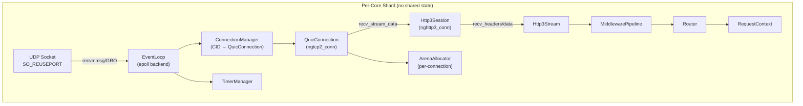
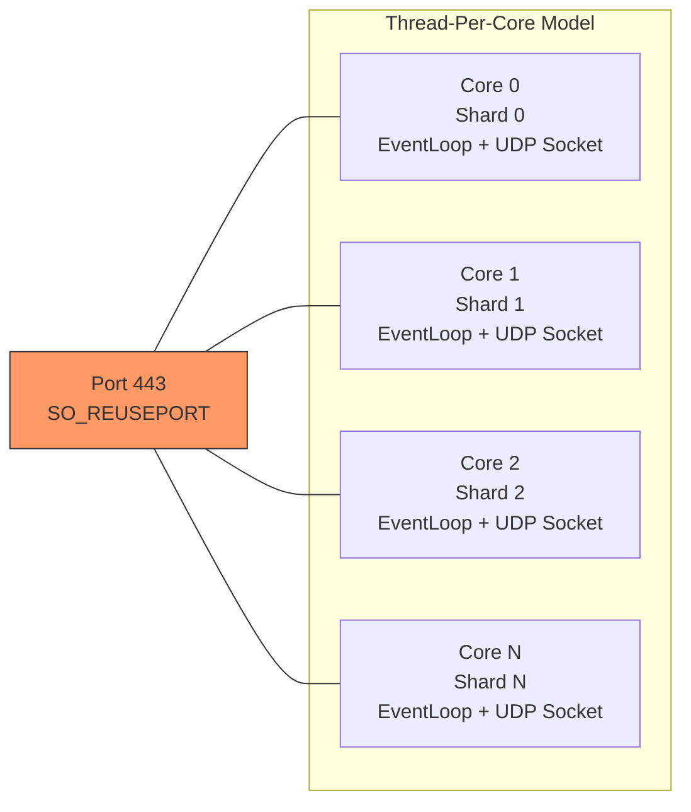

# NovaBoot — Phase 1: Core HTTP/3 Server

A production-grade, HTTP/3-only C++ framework inspired by Spring Boot. Built on **ngtcp2** (QUIC transport) + **nghttp3** (HTTP/3 framing) + **OpenSSL** (TLS 1.3), targeting **Linux only** with a **thread-per-core** architecture.

## Architecture Overview





## User Review Required

> [!IMPORTANT]
> **Dependency Fetching Strategy**: The plan uses CMake `FetchContent` to pull ngtcp2, nghttp3, and other dependencies at configure time. This means the first build will download sources. Alternative: git submodules. Which do you prefer?

> [!IMPORTANT]
> **EventLoop Backend**: Phase 1 uses **epoll** as the EventLoop backend. The `EventLoop` class is designed as an abstract interface so an **io_uring** backend can be swapped in Phase 2 without changing any framework or user code. Is this acceptable, or do you want io_uring from day one?

> [!WARNING]
> **OpenSSL Version**: ngtcp2's OpenSSL backend (`ngtcp2_crypto_quictls`) requires OpenSSL 3.5.0+ (which has native QUIC TLS support) **or** the older `quictls` fork. We will target OpenSSL 3.5.0+. Ensure your system has it or we'll build it from source via FetchContent.

## Open Questions

1. **Connection Migration**: QUIC supports connection migration (client changes IP/port mid-session). Should we support this in Phase 1, or defer? It adds complexity to the CID-based connection lookup.
2. **0-RTT**: Should we support 0-RTT (early data) in Phase 1? It requires session ticket management and has security implications (replay attacks).
3. **Rate Limiting**: Should the core have built-in rate limiting per-connection or is that a middleware concern for later?

---

## Proposed Changes

### Project Structure

```
novaboot/
├── CMakeLists.txt                     # Root CMake
├── cmake/
│   └── Dependencies.cmake             # FetchContent for ngtcp2, nghttp3, etc.
├── include/novaboot/
│   ├── novaboot.h                     # Umbrella header
│   ├── core/
│   │   ├── event_loop.h               # EventLoop interface
│   │   ├── epoll_event_loop.h         # epoll implementation
│   │   ├── timer.h                    # Timer/deadline management
│   │   ├── shard.h                    # Per-core shard (owns EventLoop + connections)
│   │   └── server.h                   # Server orchestrator (spawns shards)
│   ├── net/
│   │   ├── udp_socket.h               # UDP socket with SO_REUSEPORT, GRO/GSO
│   │   ├── address.h                  # sockaddr wrapper
│   │   └── packet.h                   # Incoming/outgoing packet buffer
│   ├── quic/
│   │   ├── quic_connection.h          # ngtcp2_conn wrapper
│   │   ├── connection_manager.h       # CID → QuicConnection map
│   │   ├── tls_context.h              # OpenSSL SSL_CTX setup
│   │   └── tls_session.h              # Per-connection SSL object
│   ├── http3/
│   │   ├── http3_session.h            # nghttp3_conn wrapper
│   │   ├── http3_stream.h             # Individual HTTP/3 stream
│   │   ├── request.h                  # HTTP request (headers + body)
│   │   ├── response.h                 # HTTP response builder
│   │   └── header_map.h              # Efficient header storage
│   ├── router/
│   │   ├── router.h                   # Radix-tree based URL router
│   │   ├── route.h                    # Route definition
│   │   └── path_params.h             # Extracted path parameters
│   ├── middleware/
│   │   ├── middleware.h               # Middleware interface
│   │   └── pipeline.h                 # Middleware chain executor
│   ├── context/
│   │   └── request_context.h          # Per-request context (DI container seed)
│   └── memory/
│       ├── arena_allocator.h          # Per-connection arena allocator
│       └── pool_allocator.h           # Fixed-size object pool
├── src/
│   ├── core/
│   │   ├── epoll_event_loop.cpp
│   │   ├── shard.cpp
│   │   ├── server.cpp
│   │   └── timer.cpp
│   ├── net/
│   │   ├── udp_socket.cpp
│   │   └── address.cpp
│   ├── quic/
│   │   ├── quic_connection.cpp
│   │   ├── connection_manager.cpp
│   │   ├── tls_context.cpp
│   │   └── tls_session.cpp
│   ├── http3/
│   │   ├── http3_session.cpp
│   │   ├── http3_stream.cpp
│   │   ├── request.cpp
│   │   ├── response.cpp
│   │   └── header_map.cpp
│   ├── router/
│   │   └── router.cpp
│   ├── middleware/
│   │   └── pipeline.cpp
│   ├── context/
│   │   └── request_context.cpp
│   └── memory/
│       ├── arena_allocator.cpp
│       └── pool_allocator.cpp
├── tests/
│   ├── CMakeLists.txt
│   ├── unit/
│   │   ├── test_router.cpp
│   │   ├── test_arena_allocator.cpp
│   │   ├── test_header_map.cpp
│   │   ├── test_middleware_pipeline.cpp
│   │   └── test_request_context.cpp
│   └── integration/
│       └── test_server_basic.cpp
├── bench/
│   ├── CMakeLists.txt
│   └── bench_router.cpp
└── examples/
    └── hello_world.cpp
```

---

### Component 1: Build System

#### [NEW] [CMakeLists.txt](file:///home/uday/Projects/novaboot/CMakeLists.txt) (overwrite)
Root CMake configuration:
- C++23 standard enforced (`-std=c++23`)
- Compiler flags: `-Wall -Wextra -Wpedantic -Werror` for debug; `-O3 -march=native -flto` for release
- Link `novaboot` as a static library
- Export `novaboot::novaboot` CMake target for downstream consumers
- Thread linking (`Threads::Threads`)

#### [NEW] [Dependencies.cmake](file:///home/uday/Projects/novaboot/cmake/Dependencies.cmake)
FetchContent declarations for:
- **ngtcp2** (latest release tag)
- **nghttp3** (latest release tag)
- **OpenSSL** (find system install, require 3.5.0+)
- **spdlog** (v1.x, header-only mode)
- **simdjson** (latest)
- **Google Test** (for tests)
- **Google Benchmark** (for benchmarks)

---

### Component 2: Memory Subsystem

#### [NEW] [arena_allocator.h](file:///home/uday/Projects/novaboot/include/novaboot/memory/arena_allocator.h)
Per-connection arena allocator:
- Allocates from large pre-mapped blocks (e.g., 64KB pages via `mmap`)
- Bump-pointer allocation (O(1) alloc, zero fragmentation)
- Bulk deallocation on connection close (just reset the pointer)
- Satisfies `std::pmr::memory_resource` interface for STL container compatibility
- Falls back to `malloc` for oversized allocations

#### [NEW] [pool_allocator.h](file:///home/uday/Projects/novaboot/include/novaboot/memory/pool_allocator.h)
Fixed-size object pool for hot types:
- Pre-allocates N objects of a fixed size
- Free-list based allocation/deallocation
- Used for `QuicConnection`, `Http3Stream`, `RequestContext` objects
- Thread-local (no synchronization needed in thread-per-core model)

---

### Component 3: EventLoop (epoll backend)

#### [NEW] [event_loop.h](file:///home/uday/Projects/novaboot/include/novaboot/core/event_loop.h)
Abstract `EventLoop` interface:
```cpp
class EventLoop {
public:
    using Callback = std::move_only_function<void(uint32_t events)>;
    
    virtual ~EventLoop() = default;
    virtual void add_fd(int fd, uint32_t events, Callback cb) = 0;
    virtual void modify_fd(int fd, uint32_t events) = 0;
    virtual void remove_fd(int fd) = 0;
    
    // Timer support
    virtual TimerHandle add_timer(Duration delay, std::move_only_function<void()> cb) = 0;
    virtual void cancel_timer(TimerHandle handle) = 0;
    
    // Run the loop (blocks)
    virtual void run() = 0;
    virtual void stop() = 0;
};
```
This abstraction allows swapping epoll → io_uring later without touching anything above this layer.

#### [NEW] [epoll_event_loop.h](file:///home/uday/Projects/novaboot/include/novaboot/core/epoll_event_loop.h) / [epoll_event_loop.cpp](file:///home/uday/Projects/novaboot/src/core/epoll_event_loop.cpp)
Concrete epoll implementation:
- Uses `epoll_create1(EPOLL_CLOEXEC)`
- `timerfd` for timer management (integrated into the epoll set)
- Min-heap for timer ordering
- `epoll_wait` with dynamic timeout based on nearest timer deadline
- Handles `EPOLLIN`, `EPOLLOUT`, `EPOLLET` (edge-triggered for sockets)

---

### Component 4: Networking

#### [NEW] [udp_socket.h](file:///home/uday/Projects/novaboot/include/novaboot/net/udp_socket.h) / [udp_socket.cpp](file:///home/uday/Projects/novaboot/src/net/udp_socket.cpp)
High-performance UDP socket:
- `SO_REUSEPORT` — each shard binds to the same port
- `SO_REUSEADDR`
- Non-blocking (`O_NONBLOCK`)
- `IP_PKTINFO` / `IPV6_RECVPKTINFO` — know which local address received the packet
- **UDP GRO**: `UDP_GRO` socket option to receive coalesced datagrams
- **UDP GSO**: `UDP_SEGMENT` via `sendmsg` ancillary data for batched sends
- `recvmmsg()` — receive multiple datagrams in a single syscall
- `sendmmsg()` — send multiple datagrams in a single syscall
- Dual-stack (IPv4 + IPv6) support

#### [NEW] [address.h](file:///home/uday/Projects/novaboot/include/novaboot/net/address.h)
Type-safe `sockaddr` wrapper:
- Supports IPv4 and IPv6
- Comparison operators, hash function (for use as map key)
- `to_string()` for logging

#### [NEW] [packet.h](file:///home/uday/Projects/novaboot/include/novaboot/net/packet.h)
Packet buffer management:
- `IncomingPacket`: holds raw bytes + source address + destination address + timestamp
- `OutgoingPacket`: holds encrypted QUIC packet bytes + destination address
- Uses arena allocator for buffer memory

---

### Component 5: QUIC Layer

#### [NEW] [tls_context.h](file:///home/uday/Projects/novaboot/include/novaboot/quic/tls_context.h) / [tls_context.cpp](file:///home/uday/Projects/novaboot/src/quic/tls_context.cpp)
Shared TLS context (one per server):
- Creates and configures `SSL_CTX` for QUIC server use
- Loads certificate + private key
- Sets ALPN (`h3`)
- Uses `ngtcp2_crypto_quictls_configure_server_context()` helper
- Configures session tickets for 0-RTT (if enabled)

#### [NEW] [tls_session.h](file:///home/uday/Projects/novaboot/include/novaboot/quic/tls_session.h) / [tls_session.cpp](file:///home/uday/Projects/novaboot/src/quic/tls_session.cpp)
Per-connection TLS session:
- Creates `SSL` object from `SSL_CTX`
- Integrates with ngtcp2 crypto callbacks
- Manages handshake state

#### [NEW] [quic_connection.h](file:///home/uday/Projects/novaboot/include/novaboot/quic/quic_connection.h) / [quic_connection.cpp](file:///home/uday/Projects/novaboot/src/quic/quic_connection.cpp)
Core QUIC connection wrapper:
- Owns `ngtcp2_conn*` (created via `ngtcp2_conn_server_new`)
- Owns `TlsSession`
- Owns `Http3Session`
- Owns `ArenaAllocator` (all per-connection allocations use this)
- Implements all `ngtcp2_callbacks`:
  - `recv_client_initial` → version negotiation
  - `recv_crypto_data` → feed to OpenSSL
  - `encrypt` / `decrypt` / `hp_mask` → crypto operations
  - `recv_stream_data` → forward to nghttp3 via `nghttp3_conn_read_stream`
  - `stream_close` → forward to nghttp3
  - `acked_stream_data_offset` → forward to nghttp3
  - `rand` → random bytes
  - `get_new_connection_id` → generate new CIDs
- Handles retransmission timers via EventLoop
- Writes outgoing packets via `ngtcp2_conn_writev_stream` + GSO batching

#### [NEW] [connection_manager.h](file:///home/uday/Projects/novaboot/include/novaboot/quic/connection_manager.h) / [connection_manager.cpp](file:///home/uday/Projects/novaboot/src/quic/connection_manager.cpp)
Per-shard connection tracking:
- Maps Connection IDs (CID) → `QuicConnection*`
- Handles initial packet routing (new connection detection via `ngtcp2_accept`)
- Supports multiple CIDs per connection (CID rotation)
- Connection lifecycle management (creation, idle timeout, graceful close)
- Uses `robin_hood::unordered_map` or `absl::flat_hash_map` for fast CID lookup

---

### Component 6: HTTP/3 Layer

#### [NEW] [http3_session.h](file:///home/uday/Projects/novaboot/include/novaboot/http3/http3_session.h) / [http3_session.cpp](file:///home/uday/Projects/novaboot/src/http3/http3_session.cpp)
HTTP/3 session wrapper (one per QUIC connection):
- Owns `nghttp3_conn*` (created via `nghttp3_conn_server_new`)
- Implements `nghttp3_callbacks`:
  - `recv_header` → accumulate request headers
  - `end_headers` → headers complete, can start routing
  - `recv_data` → request body data
  - `end_stream` → request fully received
  - `acked_stream_data` → release response buffers
  - `deferred_consume` → flow control
- Creates `Http3Stream` objects for each new stream
- Manages control streams and QPACK encoder/decoder streams

#### [NEW] [http3_stream.h](file:///home/uday/Projects/novaboot/include/novaboot/http3/http3_stream.h) / [http3_stream.cpp](file:///home/uday/Projects/novaboot/src/http3/http3_stream.cpp)
Individual HTTP/3 request/response stream:
- Owns the `Request` object (populated by callbacks)
- Owns the `Response` object (populated by route handler)
- Tracks stream state (headers received, body receiving, complete)
- Submits response headers via `nghttp3_conn_submit_response`
- Provides response body data via `nghttp3_conn_read_stream` data provider callback

#### [NEW] [request.h](file:///home/uday/Projects/novaboot/include/novaboot/http3/request.h) / [request.cpp](file:///home/uday/Projects/novaboot/src/http3/request.cpp)
HTTP request representation:
- Method, path, scheme, authority (from pseudo-headers)
- `HeaderMap` for headers
- Body as `std::span<const uint8_t>` (zero-copy from arena)
- Path parameters (populated by router)
- Query parameters (lazy-parsed)

#### [NEW] [response.h](file:///home/uday/Projects/novaboot/include/novaboot/http3/response.h) / [response.cpp](file:///home/uday/Projects/novaboot/src/http3/response.cpp)
HTTP response builder (fluent API):
```cpp
res.status(200)
   .header("Content-Type", "application/json")
   .body(json_string);
```
- Status code
- Headers
- Body (string, byte buffer, or streaming callback)
- Automatic `content-length` calculation

#### [NEW] [header_map.h](file:///home/uday/Projects/novaboot/include/novaboot/http3/header_map.h)
Case-insensitive header storage:
- Optimized for common headers (pre-hashed, small-buffer optimization)
- Supports multi-value headers
- Allocates from arena allocator

---

### Component 7: Router

#### [NEW] [router.h](file:///home/uday/Projects/novaboot/include/novaboot/router/router.h) / [router.cpp](file:///home/uday/Projects/novaboot/src/router/router.cpp)
Radix-tree (compressed trie) URL router:
- O(path_length) lookup time
- Supports:
  - Static paths: `/api/users`
  - Path parameters: `/api/users/:id`
  - Wildcard: `/static/*filepath`
- Per-method dispatch (GET, POST, PUT, DELETE, PATCH, HEAD, OPTIONS)
- Route-level middleware attachment
- Compile-time route validation where possible

#### [NEW] [route.h](file:///home/uday/Projects/novaboot/include/novaboot/router/route.h)
Route definition:
```cpp
using Handler = std::move_only_function<void(Request&, Response&, RequestContext&)>;
```

#### [NEW] [path_params.h](file:///home/uday/Projects/novaboot/include/novaboot/router/path_params.h)
Extracted path parameter storage:
- Backed by arena allocator
- `get<T>("id")` with type conversion

---

### Component 8: Middleware Pipeline

#### [NEW] [middleware.h](file:///home/uday/Projects/novaboot/include/novaboot/middleware/middleware.h)
Middleware interface:
```cpp
class Middleware {
public:
    using Next = std::move_only_function<void()>;
    virtual ~Middleware() = default;
    virtual void handle(Request& req, Response& res, RequestContext& ctx, Next next) = 0;
};
```

#### [NEW] [pipeline.h](file:///home/uday/Projects/novaboot/include/novaboot/middleware/pipeline.h) / [pipeline.cpp](file:///home/uday/Projects/novaboot/src/middleware/pipeline.cpp)
Middleware chain executor:
- Builds a chain of middleware + final handler
- Executes in order; each middleware calls `next()` to continue or short-circuits
- Pre-built (composed at server startup, not per-request)
- Supports global middleware and per-route middleware

---

### Component 9: Request Context & DI

#### [NEW] [request_context.h](file:///home/uday/Projects/novaboot/include/novaboot/context/request_context.h) / [request_context.cpp](file:///home/uday/Projects/novaboot/src/context/request_context.cpp)
Per-request context:
- Type-erased key-value store (`std::type_index` → `std::any`)
- Middleware can set values, downstream handlers can retrieve them
- Allocated from the connection's arena
- Provides `get<T>()` / `set<T>(value)` API
- Seeds for DI: holds database connections, auth info, etc.

---

### Component 10: Shard & Server Orchestrator

#### [NEW] [shard.h](file:///home/uday/Projects/novaboot/include/novaboot/core/shard.h) / [shard.cpp](file:///home/uday/Projects/novaboot/src/core/shard.cpp)
Per-core shard:
- Owns: `EventLoop`, `UdpSocket`, `ConnectionManager`, reference to `Router`
- Pins thread to CPU core (`pthread_setaffinity_np`)
- Main loop:
  1. `recvmmsg()` → batch receive UDP datagrams
  2. For each datagram: lookup or create `QuicConnection` via `ConnectionManager`
  3. Feed packet into `ngtcp2_conn_read_pkt`
  4. Process ngtcp2/nghttp3 callbacks (headers → router → handler → response)
  5. Collect outgoing packets from all connections
  6. `sendmmsg()` with GSO → batch send
  7. Process timer expirations (retransmissions, idle timeouts)

#### [NEW] [server.h](file:///home/uday/Projects/novaboot/include/novaboot/core/server.h) / [server.cpp](file:///home/uday/Projects/novaboot/src/core/server.cpp)
Server orchestrator — the user-facing entry point:
```cpp
auto app = novaboot::Server::create()
    .bind("0.0.0.0", 443)
    .tls("/path/to/cert.pem", "/path/to/key.pem")
    .workers(std::thread::hardware_concurrency())
    .middleware(std::make_shared<LoggingMiddleware>())
    .build();

app->route("/api/hello")
    .get([](auto& req, auto& res, auto& ctx) {
        res.status(200)
           .header("Content-Type", "text/plain")
           .body("Hello from NovaBoot!");
    });

app->route("/api/users/:id")
    .get([](auto& req, auto& res, auto& ctx) {
        auto id = req.path_params().get<int>("id");
        // ... 
    });

app->run(); // blocks, spawns shards
```
- Validates configuration
- Creates `TlsContext` (shared read-only across shards)
- Spawns N `Shard` threads
- Signal handling (`SIGINT`, `SIGTERM`) for graceful shutdown
- Graceful shutdown: sends GOAWAY on all connections, drains, exits

---

### Component 11: Example & Smoke Test

#### [NEW] [hello_world.cpp](file:///home/uday/Projects/novaboot/examples/hello_world.cpp)
Minimal working example showing the API.

---

## Implementation Order

The build order respects dependencies (bottom-up):

| Phase | Components | Rationale |
|-------|-----------|-----------|
| **1a** | Memory (arena, pool) | Zero dependencies, everything else uses these |
| **1b** | Address, Packet | Simple types, no external deps |
| **1c** | EventLoop + EpollEventLoop + Timer | Core reactor, needed by everything above |
| **1d** | UdpSocket | Networking primitive, depends on EventLoop |
| **1e** | TlsContext + TlsSession | OpenSSL setup, needed by QUIC |
| **1f** | QuicConnection + ConnectionManager | ngtcp2 integration, depends on all above |
| **1g** | HeaderMap, Request, Response | HTTP types, no external deps |
| **1h** | Http3Session + Http3Stream | nghttp3 integration, depends on QUIC + HTTP types |
| **1i** | Router, PathParams | URL routing, standalone |
| **1j** | Middleware + Pipeline + RequestContext | Middleware chain, depends on HTTP types |
| **1k** | Shard | Wires everything together per-core |
| **1l** | Server | Top-level orchestrator |
| **1m** | Example + Tests | Validation |

---

## Key Design Decisions

1. **No `std::shared_ptr` in hot paths** — Raw pointers with clear ownership (parent owns child). Arena deallocation handles cleanup.
2. **No exceptions in hot paths** — Use `std::expected<T, Error>` (C++23) for error handling. Exceptions only for startup/configuration errors.
3. **Zero-copy where possible** — Request body data points directly into the receive buffer (arena-backed). No unnecessary copies.
4. **Callbacks, not coroutines (Phase 1)** — ngtcp2 and nghttp3 are callback-based C libraries. We wrap them cleanly in C++ but don't add a coroutine layer yet. Coroutine support can be layered on top in Phase 2.
5. **Edge-triggered epoll** — Requires careful read/write draining but reduces epoll_wait wakeups.

---

## Verification Plan

### Automated Tests
```bash
# Build everything
cmake -B build -DCMAKE_BUILD_TYPE=Debug -DNOVABOOT_BUILD_TESTS=ON
cmake --build build -j$(nproc)

# Run unit tests
cd build && ctest --output-on-failure

# Run specific test suites
./build/tests/test_router
./build/tests/test_arena_allocator
./build/tests/test_header_map
./build/tests/test_middleware_pipeline
```

### Manual Verification
- **Smoke test**: Run the `hello_world` example, hit it with `curl --http3` (requires curl built with HTTP/3 support) or `h2load` with `--h3` flag
- **Multiplexing test**: Send multiple concurrent requests on the same connection, verify all complete correctly
- **Memory leak check**: Run under Valgrind / AddressSanitizer (`-fsanitize=address,undefined`)
- **Performance baseline**: Run `h2load --h3 -n 100000 -c 100` to establish initial throughput numbers

### Build Verification
```bash
# AddressSanitizer build
cmake -B build-asan -DCMAKE_BUILD_TYPE=Debug \
  -DCMAKE_CXX_FLAGS="-fsanitize=address,undefined" \
  -DCMAKE_EXE_LINKER_FLAGS="-fsanitize=address,undefined"
cmake --build build-asan -j$(nproc)
```
