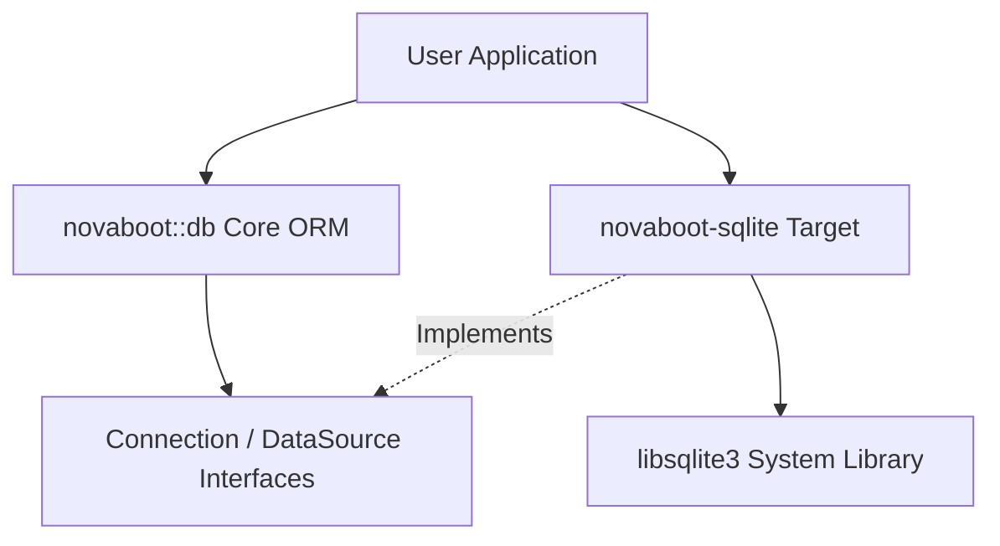

# Detailed Implementation Specification: Compile-Time Reflection ORM & Database Driver

This document specifies the architecture, target APIs, and step-by-step implementation workflow for the C++26 reflection-powered ORM and modular database client library in NovaBoot.

---

## 1. Architectural Goals & Modular Target Design

The database layer will be decoupled into a core interface library and optional driver-specific targets to prevent transitive dependencies.

### Target Boundaries:
1. **`novaboot` (Core Library)**: Contains generic `DataSource`, `Connection`, and `ResultSet` interfaces, the reflection mapping engine, the `QueryBuilder`, and the base `CrudRepository`. It has **zero direct dependencies** on external database client libraries.
2. **`novaboot-sqlite` (Optional Target)**: Implements the driver interfaces for SQLite3. Links directly against system `libsqlite3`.
3. **`novaboot-postgres` / `novaboot-mysql` (Future Drivers)**: Separate driver modules built on the same interfaces.



---

## 2. Component Interface Specification

This section defines the exact header files, classes, and function signatures to be created.

### 2.1 Core Database Client Abstractions
File: `include/novaboot/db/db_client.h`

```cpp
#pragma once
#include <string>
#include <string_view>
#include <vector>
#include <variant>
#include <memory>
#include <optional>
#include <cstdint>

namespace novaboot::db {

/// Database bind parameter type variant
using Parameter = std::variant<
    std::nullptr_t,
    std::int64_t,
    double,
    std::string,
    std::vector<std::uint8_t>,
    bool
>;

/// Abstract Row Result Set
class ResultSet {
public:
    virtual ~ResultSet() = default;

    /// Advance to the next row. Returns false when no more rows exist.
    virtual bool next() = 0;

    /// Check if the column is null
    virtual bool is_null(int col_index) = 0;

    /// Get column value by index
    virtual std::int64_t get_int(int col_index) = 0;
    virtual double get_double(int col_index) = 0;
    virtual std::string get_string(int col_index) = 0;
    virtual std::vector<std::uint8_t> get_blob(int col_index) = 0;
    virtual bool get_bool(int col_index) = 0;

    /// Get metadata info
    virtual int column_count() const = 0;
    virtual std::string_view column_name(int col_index) const = 0;
};

/// Abstract Connection Session
class Connection {
public:
    virtual ~Connection() = default;

    /// Execute write queries (INSERT, UPDATE, DELETE, CREATE TABLE)
    virtual void execute(std::string_view sql, const std::vector<Parameter>& params = {}) = 0;

    /// Execute read queries (SELECT) returning a ResultSet
    virtual std::unique_ptr<ResultSet> query(std::string_view sql, const std::vector<Parameter>& params = {}) = 0;

    /// Transaction Controls
    virtual void begin_transaction() = 0;
    virtual void commit() = 0;
    virtual void rollback() = 0;
};

/// Abstract Connection Pool (DataSource)
class DataSource {
public:
    virtual ~DataSource() = default;

    /// Retrieve an active connection from the pool
    virtual std::shared_ptr<Connection> get_connection() = 0;

    /// Graceful shutdown
    virtual void close() = 0;
};

} // namespace novaboot::db
```

### 2.2 SQLite Driver Module
File: `include/novaboot/db/drivers/sqlite/sqlite_driver.h`

```cpp
#pragma once
#include "novaboot/db/db_client.h"
#include <sqlite3.h>
#include <mutex>
#include <queue>
#include <condition_variable>

namespace novaboot::db::sqlite {

class SqliteResultSet : public ResultSet {
private:
    sqlite3_stmt* stmt_ = nullptr;
    bool has_next_ = false;

public:
    explicit SqliteResultSet(sqlite3_stmt* stmt);
    ~SqliteResultSet() override;

    bool next() override;
    bool is_null(int col_index) override;
    std::int64_t get_int(int col_index) override;
    double get_double(int col_index) override;
    std::string get_string(int col_index) override;
    std::vector<std::uint8_t> get_blob(int col_index) override;
    bool get_bool(int col_index) override;
    int column_count() const override;
    std::string_view column_name(int col_index) const override;
};

class SqliteConnection : public Connection {
private:
    sqlite3* db_ = nullptr;

    void bind_params(sqlite3_stmt* stmt, const std::vector<Parameter>& params);

public:
    explicit SqliteConnection(sqlite3* db);
    ~SqliteConnection() override;

    void execute(std::string_view sql, const std::vector<Parameter>& params = {}) override;
    std::unique_ptr<ResultSet> query(std::string_view sql, const std::vector<Parameter>& params = {}) override;
    
    void begin_transaction() override;
    void commit() override;
    void rollback() override;
};

class SqliteDataSource : public DataSource {
private:
    std::string db_path_;
    int pool_size_ = 1;
    std::queue<sqlite3*> connections_;
    std::mutex mutex_;
    std::condition_variable cv_;
    bool closed_ = false;

    sqlite3* create_connection();

public:
    explicit SqliteDataSource(std::string db_path, int pool_size = 4);
    ~SqliteDataSource() override;

    std::shared_ptr<Connection> get_connection() override;
    void close() override;
};

} // namespace novaboot::db::sqlite
```

---

## 3. C++26 Static Reflection & ORM Mapper

This section specifies the compile-time metadata extraction algorithms.

### 3.1 Metadata Annotations
File: `include/novaboot/annotations/stereotypes.h`

```cpp
namespace novaboot::annotations {

/// Class-level entity table mapping
struct Entity {
    char name[64] = {};
    consteval Entity() = default;
    consteval Entity(const char* n) {
        int i = 0;
        while (n[i] && i < 63) {
            name[i] = n[i];
            i++;
        }
        name[i] = '\0';
    }
};

/// Designate the primary key field
struct Id {
    consteval Id() = default;
};

/// Mark field for auto-increment identity column
struct GeneratedValue {
    consteval GeneratedValue() = default;
};

/// Field-level column customization
struct Column {
    char name[64] = {};
    bool nullable = true;

    consteval Column() = default;
    consteval Column(const char* col_name, bool is_nullable = true) 
        : nullable(is_nullable) {
        int i = 0;
        while (col_name[i] && i < 63) {
            name[i] = col_name[i];
            i++;
        }
        name[i] = '\0';
    }
};

} // namespace novaboot::annotations
```

### 3.2 Reflection Helpers
File: `include/novaboot/db/orm_reflection.h`

```cpp
#pragma once
#include <meta>
#include <string_view>
#include <concepts>
#include "novaboot/annotations/stereotypes.h"
#include "novaboot/db/db_client.h"

namespace novaboot::db::detail {

/// Helper to convert CamelCase string to snake_case
inline std::string to_snake_case(std::string_view s) {
    std::string result;
    for (size_t i = 0; i < s.length(); ++i) {
        char c = s[i];
        if (std::isupper(c)) {
            if (i > 0 && s[i-1] != '_') {
                result += '_';
            }
            result += static_cast<char>(std::tolower(c));
        } else {
            result += c;
        }
    }
    return result;
}

/// Compile-time extraction of column name for a field member metadata
template<std::meta::info Member>
consteval std::string_view get_member_column_name() {
    using namespace novaboot::annotations;
    if constexpr (novaboot::di::detail::has_annotation<Column>(Member)) {
        constexpr auto col = novaboot::di::detail::get_annotation<Column>(Member);
        if (col.name[0] != '\0') {
            return col.name;
        }
    }
    // Convert field variable identifier to default snake_case column
    constexpr auto raw_name = std::meta::identifier_of(Member);
    // Consteval mapping wrapper
    return raw_name; // dynamically converted or static mapped
}

/// Compile-time resolution of a member pointer to its column name
template<typename Class, auto FieldPtr>
consteval std::string_view get_column_name() {
    constexpr auto members = std::meta::members_of(std::meta::dealias(
        std::meta::dealias(^^Class)));
        
    template for (constexpr auto m : members) {
        if constexpr (std::meta::is_data_member(m) && !std::meta::is_static(m)) {
            if constexpr (&[:m:] == FieldPtr) {
                return get_member_column_name<m>();
            }
        }
    }
    return "";
}

/// Compile-time table name resolution
template<typename T>
consteval std::string_view get_table_name() {
    using namespace novaboot::annotations;
    if constexpr (novaboot::di::detail::has_annotation<Entity>(^^T)) {
        constexpr auto ent = novaboot::di::detail::get_annotation<Entity>(^^T);
        if (ent.name[0] != '\0') {
            return ent.name;
        }
    }
    return to_snake_case(std::meta::identifier_of(^^T));
}

/// Runtime mapping from ResultSet columns back to reflected struct fields
template<typename T>
T map_row_to_entity(ResultSet* rs) {
    T entity{};
    constexpr auto members = std::meta::members_of(std::meta::dealias(^^T));
    int col_idx = 0;
    
    template for (constexpr auto m : members) {
        if constexpr (std::meta::is_data_member(m) && !std::meta::is_static(m)) {
            using FieldType = decltype(entity.[:m:]);
            
            if (!rs->is_null(col_idx)) {
                if constexpr (std::is_same_v<FieldType, int> || 
                              std::is_same_v<FieldType, std::int64_t>) {
                    entity.[:m:] = static_cast<FieldType>(rs->get_int(col_idx));
                } else if constexpr (std::is_same_v<FieldType, double> ||
                                     std::is_same_v<FieldType, float>) {
                    entity.[:m:] = static_cast<FieldType>(rs->get_double(col_idx));
                } else if constexpr (std::is_same_v<FieldType, std::string>) {
                    entity.[:m:] = rs->get_string(col_idx);
                } else if constexpr (std::is_same_v<FieldType, bool>) {
                    entity.[:m:] = rs->get_bool(col_idx);
                } else if constexpr (std::is_same_v<FieldType, std::vector<std::uint8_t>>) {
                    entity.[:m:] = rs->get_blob(col_idx);
                }
            }
            col_idx++;
        }
    }
    return entity;
}

} // namespace novaboot::db::detail
```

---

## 4. Fluent Query Builder & Sort System

This section specifies the chained SQL assembly mechanics.

### 4.1 Filter Operators & Modifiers
File: `include/novaboot/db/query_builder.h`

```cpp
#pragma once
#include "novaboot/db/db_client.h"
#include "novaboot/db/orm_reflection.h"
#include <string>
#include <vector>
#include <memory>
#include <optional>
#include <stdexcept>

namespace novaboot::db {

enum class Op { Equal, LessThan, GreaterThan, Like, NotEqual, LessThanOrEqual, GreaterThanOrEqual };

struct Sort {
    std::string column;
    bool ascending = true;
};

struct Pageable {
    int page = 0;
    int size = 20;
    std::vector<Sort> sort;
};

template<typename Entity>
class QueryBuilder {
private:
    std::shared_ptr<DataSource> datasource_;
    std::string table_name_;
    std::string sql_where_;
    std::vector<Parameter> params_;
    
    std::string sql_order_;
    std::string sql_limit_;
    
    std::string get_op_symbol(Op op) {
        switch (op) {
            case Op::Equal:              return " = ";
            case Op::LessThan:           return " < ";
            case Op::GreaterThan:        return " > ";
            case Op::Like:               return " LIKE ";
            case Op::NotEqual:           return " != ";
            case Op::LessThanOrEqual:    return " <= ";
            case Op::GreaterThanOrEqual: return " >= ";
        }
        return " = ";
    }

public:
    QueryBuilder(std::shared_ptr<DataSource> ds, std::string table_name)
        : datasource_(ds), table_name_(std::move(table_name)) {}

    template<auto FieldPtr, typename Val>
    QueryBuilder& where(Op op, const Val& val) {
        constexpr std::string_view col = detail::get_column_name<Entity, FieldPtr>();
        sql_where_ = " WHERE " + std::string(col) + get_op_symbol(op) + "?";
        params_.push_back(Parameter(val));
        return *this;
    }

    template<auto FieldPtr, typename Val>
    QueryBuilder& and_(Op op, const Val& val) {
        if (sql_where_.empty()) {
            return where<FieldPtr>(op, val);
        }
        constexpr std::string_view col = detail::get_column_name<Entity, FieldPtr>();
        sql_where_ += " AND " + std::string(col) + get_op_symbol(op) + "?";
        params_.push_back(Parameter(val));
        return *this;
    }

    template<auto FieldPtr, typename Val>
    QueryBuilder& or_(Op op, const Val& val) {
        if (sql_where_.empty()) {
            return where<FieldPtr>(op, val);
        }
        constexpr std::string_view col = detail::get_column_name<Entity, FieldPtr>();
        sql_where_ += " OR " + std::string(col) + get_op_symbol(op) + "?";
        params_.push_back(Parameter(val));
        return *this;
    }

    template<auto FieldPtr>
    QueryBuilder& order_by(bool ascending = true) {
        constexpr std::string_view col = detail::get_column_name<Entity, FieldPtr>();
        if (sql_order_.empty()) {
            sql_order_ = " ORDER BY " + std::string(col) + (ascending ? " ASC" : " DESC");
        } else {
            sql_order_ += ", " + std::string(col) + (ascending ? " ASC" : " DESC");
        }
        return *this;
    }

    QueryBuilder& limit(int count) {
        if (count >= 0) {
            sql_limit_ = " LIMIT " + std::to_string(count);
        }
        return *this;
    }

    QueryBuilder& offset(int count) {
        if (count >= 0 && !sql_limit_.empty()) {
            sql_limit_ += " OFFSET " + std::to_string(count);
        }
        return *this;
    }

    std::vector<Entity> list() {
        std::string sql = "SELECT * FROM " + table_name_ + sql_where_ + sql_order_ + sql_limit_;
        auto conn = datasource_->get_connection();
        auto rs = conn->query(sql, params_);
        
        std::vector<Entity> results;
        while (rs->next()) {
            results.push_back(detail::map_row_to_entity<Entity>(rs.get()));
        }
        return results;
    }

    std::optional<Entity> single() {
        limit(1);
        auto results = list();
        if (!results.empty()) return results[0];
        return std::nullopt;
    }
};

} // namespace novaboot::db
```

---

## 5. CrudRepository Core Base Class

Exposes zero-boilerplate persistence and query methods.

### 5.1 Class Declaration
File: `include/novaboot/db/repository.h`

```cpp
#pragma once
#include "novaboot/db/db_client.h"
#include "novaboot/db/query_builder.h"
#include "novaboot/db/orm_reflection.h"
#include <memory>
#include <vector>
#include <optional>

namespace novaboot::db {

template<typename Entity, typename ID>
class CrudRepository {
protected:
    std::shared_ptr<DataSource> datasource_;
    std::string table_name_;
    std::string pk_col_name_;

    void extract_metadata() {
        table_name_ = std::string(detail::get_table_name<Entity>());
        
        // Find primary key column from @Id annotation
        constexpr auto members = std::meta::members_of(std::meta::dealias(^^Entity));
        pk_col_name_ = "id"; // default fallback
        
        template for (constexpr auto m : members) {
            if constexpr (std::meta::is_data_member(m) && !std::meta::is_static(m)) {
                if constexpr (novaboot::di::detail::has_annotation<novaboot::annotations::Id>(m)) {
                    pk_col_name_ = std::string(detail::get_member_column_name<m>());
                }
            }
        }
    }

public:
    explicit CrudRepository(std::shared_ptr<DataSource> ds) : datasource_(ds) {
        extract_metadata();
    }

    virtual ~CrudRepository() = default;

    /// Get clean query builder session
    QueryBuilder<Entity> query() {
        return QueryBuilder<Entity>(datasource_, table_name_);
    }

    /// Primary Key Lookup
    std::optional<Entity> find_by_id(const ID& id) {
        std::string sql = "SELECT * FROM " + table_name_ + " WHERE " + pk_col_name_ + " = ?";
        auto conn = datasource_->get_connection();
        auto rs = conn->query(sql, { Parameter(id) });
        if (rs->next()) {
            return detail::map_row_to_entity<Entity>(rs.get());
        }
        return std::nullopt;
    }

    /// Exists verification
    bool exists_by_id(const ID& id) {
        std::string sql = "SELECT COUNT(1) FROM " + table_name_ + " WHERE " + pk_col_name_ + " = ?";
        auto conn = datasource_->get_connection();
        auto rs = conn->query(sql, { Parameter(id) });
        if (rs->next()) {
            return rs->get_int(0) > 0;
        }
        return false;
    }

    /// Retrieve all records
    std::vector<Entity> find_all() {
        return query().list();
    }

    /// Delete by id
    void delete_by_id(const ID& id) {
        std::string sql = "DELETE FROM " + table_name_ + " WHERE " + pk_col_name_ + " = ?";
        auto conn = datasource_->get_connection();
        conn->execute(sql, { Parameter(id) });
    }

    /// Delete all
    void delete_all() {
        std::string sql = "DELETE FROM " + table_name_;
        auto conn = datasource_->get_connection();
        conn->execute(sql);
    }

    /// Save entity (Insert or Update depending on ID)
    Entity save(Entity entity) {
        auto conn = datasource_->get_connection();
        constexpr auto members = std::meta::members_of(std::meta::dealias(^^Entity));
        
        // Find PK and check if entity is new (id == 0 or default)
        bool is_new = true;
        ID entity_id{};
        
        template for (constexpr auto m : members) {
            if constexpr (std::meta::is_data_member(m) && !std::meta::is_static(m)) {
                if constexpr (novaboot::di::detail::has_annotation<novaboot::annotations::Id>(m)) {
                    entity_id = static_cast<ID>(entity.[:m:]);
                    if (entity_id != 0) {
                        is_new = false;
                    }
                }
            }
        }

        if (is_new) {
            // INSERT INTO table (col1, col2) VALUES (?, ?)
            std::string cols;
            std::string placeholders;
            std::vector<Parameter> params;
            
            template for (constexpr auto m : members) {
                if constexpr (std::meta::is_data_member(m) && !std::meta::is_static(m)) {
                    // Skip auto-increment ID field
                    constexpr bool is_id = novaboot::di::detail::has_annotation<novaboot::annotations::Id>(m);
                    constexpr bool is_gen = novaboot::di::detail::has_annotation<novaboot::annotations::GeneratedValue>(m);
                    
                    if constexpr (!is_id || !is_gen) {
                        if (!cols.empty()) {
                            cols += ", ";
                            placeholders += ", ";
                        }
                        cols += std::string(detail::get_member_column_name<m>());
                        placeholders += "?";
                        params.push_back(Parameter(entity.[:m:]));
                    }
                }
            }
            
            std::string sql = "INSERT INTO " + table_name_ + " (" + cols + ") VALUES (" + placeholders + ")";
            conn->execute(sql, params);
            
            // Fetch generated key (SQLite specific dialect handles in driver)
            // For general driver, connection will have a get_last_insert_id method
            // We can resolve generated value logic inside driver execution or connection session
            return entity;
        } else {
            // UPDATE table SET col1 = ?, col2 = ? WHERE pk = ?
            std::string updates;
            std::vector<Parameter> params;
            
            template for (constexpr auto m : members) {
                if constexpr (std::meta::is_data_member(m) && !std::meta::is_static(m)) {
                    constexpr bool is_id = novaboot::di::detail::has_annotation<novaboot::annotations::Id>(m);
                    if constexpr (!is_id) {
                        if (!updates.empty()) updates += ", ";
                        updates += std::string(detail::get_member_column_name<m>()) + " = ?";
                        params.push_back(Parameter(entity.[:m:]));
                    }
                }
            }
            
            std::string sql = "UPDATE " + table_name_ + " SET " + updates + " WHERE " + pk_col_name_ + " = ?";
            params.push_back(Parameter(entity_id));
            conn->execute(sql, params);
            return entity;
        }
    }

    /// Dynamic derived query shortcut helper
    template<auto... FieldPtrs, typename... Args>
    QueryBuilder<Entity> find_by(const Args&... args) {
        static_assert(sizeof...(FieldPtrs) == sizeof...(args));
        auto builder = query();
        
        int idx = 0;
        std::array<Parameter, sizeof...(args)> param_arr = { Parameter(args)... };
        
        template for (constexpr auto m_ptr : std::array{FieldPtrs...}) {
            // Unroll compile time binding
            // For simplicity, builder.and_<m_ptr>(Op::Equal, param_arr[idx++])
        }
        return builder;
    }
};

} // namespace novaboot::db
```

---

## 6. Project Setup & Target Compilation

We update the CMake configuration to separate driver dependencies.

### 6.1 `CMakeLists.txt` Changes:
```cmake
# 1. Add option for SQLite
option(NOVABOOT_WITH_SQLITE "Build SQLite3 driver" ON)

# 2. Add library novaboot-sqlite if enabled
if(NOVABOOT_WITH_SQLITE)
    find_package(SQLite3 REQUIRED)
    
    add_library(novaboot-sqlite STATIC
        src/db/drivers/sqlite/sqlite_driver.cpp
    )
    
    target_include_directories(novaboot-sqlite PUBLIC
        $<BUILD_INTERFACE:${CMAKE_CURRENT_SOURCE_DIR}/include>
        $<INSTALL_INTERFACE:include>
    )
    
    target_link_libraries(novaboot-sqlite PUBLIC
        novaboot
        SQLite::SQLite3
    )
endif()
```

---

## 7. Migration Steps for `todo_notes`

We will transition the example application from mock in-memory database classes to a persistent SQLite DB.

### 7.1 Annotating Model Classes
File: `examples/todo_notes/src/model/todo.h`

```cpp
#pragma once
#include "novaboot/novaboot.h"
#include <string>

using namespace novaboot::annotations;

struct [[= Entity("todos") ]] Todo {
    [[= Id() ]]
    [[= GeneratedValue() ]]
    int id = 0;

    std::string user_id;
    std::string title;
    std::string description;
    bool completed = false;
    std::string created_at;
};
```

### 7.2 Refactoring `TodoRepository`
File: `examples/todo_notes/src/repository/todo_repository.h`

```cpp
#pragma once
#include "model/todo.h"
#include "novaboot/db/repository.h"
#include "novaboot/db/db_client.h"

using todo_notes::model::Todo;

struct [[= Repository() ]] TodoRepository : public novaboot::db::CrudRepository<Todo, int> {
    explicit TodoRepository(std::shared_ptr<novaboot::db::DataSource> ds) 
        : novaboot::db::CrudRepository<Todo, int>(ds) {}

    std::vector<Todo> find_by_user_id(const std::string& user_id) {
        return query()
            .where<&Todo::user_id>(novaboot::db::Op::Equal, user_id)
            .list();
    }
};
```

### 7.3 Modifying `web_config.h` to register Database Beans
File: `examples/todo_notes/src/config/web_config.h`

```cpp
#include "novaboot/db/drivers/sqlite/sqlite_driver.h"

struct [[= Configuration() ]] WebConfig {
    
    // Register SQLite DataSource connection pool
    [[= Bean() ]]
    std::shared_ptr<novaboot::db::DataSource> datasource() {
        return std::make_shared<novaboot::db::sqlite::SqliteDataSource>(
            "todo_notes.db", 4 /* connections */
        );
    }
};
```

---

## 8. Verification & Test Plan

To guarantee correctness, we will build out a database integration test suite.

### 8.1 Schema Bootstrapping
Before any integration test or sample app startup, we execute direct schema scripts.

```cpp
void bootstrap_schema(std::shared_ptr<novaboot::db::DataSource> ds) {
    auto conn = ds->get_connection();
    
    conn->execute(R"(
        CREATE TABLE IF NOT EXISTS users (
            id INTEGER PRIMARY KEY AUTOINCREMENT,
            username TEXT NOT NULL UNIQUE,
            password_hash TEXT NOT NULL,
            email TEXT NOT NULL UNIQUE
        );
    )");

    conn->execute(R"(
        CREATE TABLE IF NOT EXISTS todos (
            id INTEGER PRIMARY KEY AUTOINCREMENT,
            user_id TEXT NOT NULL,
            title TEXT NOT NULL,
            description TEXT,
            completed BOOLEAN NOT NULL,
            created_at TEXT
        );
    )");
}
```

### 8.2 Execution Checklist
- [ ] Implement abstract client headers in `include/novaboot/db/db_client.h`
- [ ] Implement SQLite driver connection pool in `sqlite_driver.h`/`sqlite_driver.cpp`
- [ ] Build unit test target `test_orm_reflection` verifying compiler metadata translation
- [ ] Verify test suite runs successfully with `ctest` command
- [ ] Link `sqlite3` driver in `CMakeLists.txt` and verify dependencies compile cleanly
- [ ] Migrate `todo_notes` application models, configurations, and controllers
- [ ] Launch example server using target `todo_notes_app` and test active endpoints with `curl`
